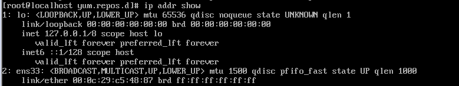
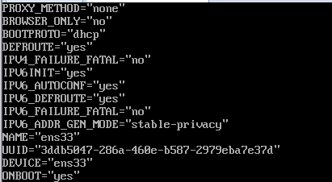
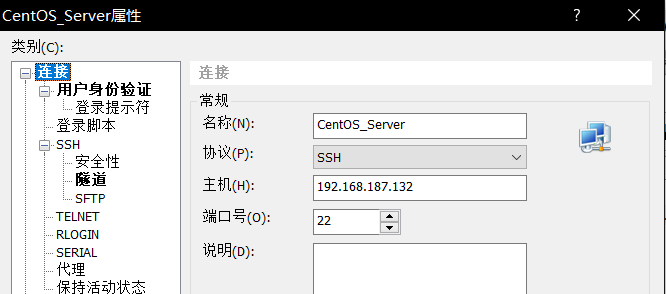
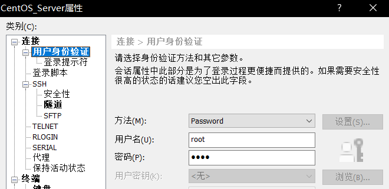
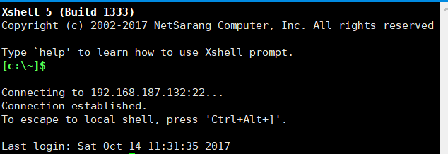

配置CentOS的网络环境和SSH登陆

=============================================

1.修改静态IP
------------
　　使用“ip addr show”显示出本机的静态IP，可以看出，本机的网络名称为ens33
　　
　　
2.修改网络配置
--------------
　　使用“vi /etc/sysconfig/network-scripts/ifcfg-ens33”,进入网络配置文件，将ONROOT修改为true.
　　
　　
3.SSH登陆
　　下载Xshell 5,在新建连接的属性输入虚拟机的IP，端口号与ens33里的保持一致。
　　
　　
4.验证
　　在用户身份验证输入虚拟机的用户名和密码。并启动连接，显示成功登陆
　　
　　